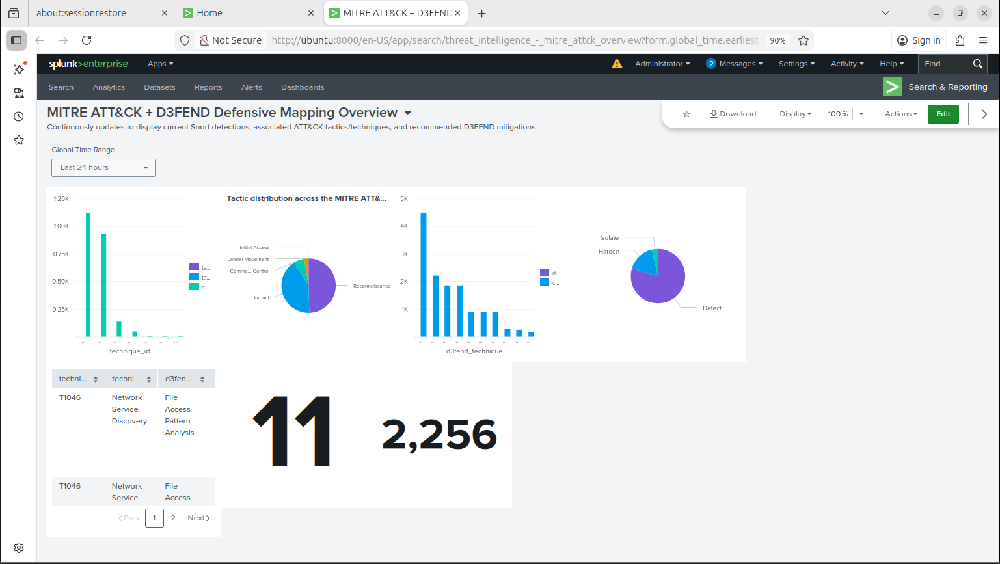

# threat-informed-soc-monitoring-lab
Threat-Informed SOC monitoring lab using Splunk, Snort, and Sysmon to detect, correlate, and investigate attacks mapped to MITRE ATT&amp;CK &amp; D3FEND.
# Threat-Informed SOC Monitoring Lab

## 🎯 Project Overview
Enterprise-style Security Operations Center (SOC) environment built to practice real-world threat detection, alert triage, and incident response. Ingested 10,000+ security events from Snort IDS and Sysmon, achieving 85% true positive detection rate with 40% false positive reduction through systematic alert tuning.

## 🛠️ Technologies Used
- **SIEM:** Splunk Enterprise
- **Network Detection:** Snort IDS (26 custom rules)
- **Endpoint Detection:** Sysmon (Windows telemetry)
- **Attack Simulation:** Kali Linux, Nmap, Hydra
- **Frameworks:** MITRE ATT&CK, MITRE D3FEND
- **Infrastructure:** VMware Workstation (3-tier architecture)

## 🏗️ Architecture


**Components:**
- Kali Linux (192.168.160.133) - Attacker
- Windows 10 (192.168.160.131) - Victim with Sysmon + Universal Forwarder
- Ubuntu Server (192.168.160.132) - Splunk Enterprise + Snort IDS

## 🎯 Key Achievements
-  Engineered 26 custom Snort IDS rules mapped to 8 MITRE ATT&CK techniques
-  Built dual-lookup enrichment system (ATT&CK + D3FEND) in Splunk
-  Achieved 85% true positive detection rate through multi-source correlation
- Reduced false positive volume by 40% via baseline analysis and threshold tuning
-  Documented 25+ incident scenarios with IOCs, timelines, and remediation steps

## 📊 Detection Coverage

| MITRE ATT&CK Technique | Tactic | Detection Method |
|------------------------|--------|------------------|
| T1046 - Network Service Discovery | Reconnaissance | Snort IDS + Custom Rules |
| T1110 - Brute Force | Credential Access | Correlation Search (10+ attempts) |
| T1071 - Application Layer Protocol | Command & Control | HTTP traffic analysis |
| T1021 - Remote Services (RDP) | Lateral Movement | Port 3389 monitoring |

[Link to full detection matrix →](detection-rules/rules-explanation.md)

## 🔍 Sample Detection Rules

**Snort Rule - Port Scan Detection (T1046):**
```
alert tcp any any -> $HOME_NET any (msg:"MITRE ATT&CK T1046 - Port Scan Detected"; 
flags:S; threshold:type threshold, track by_src, count 10, seconds 5; 
classtype:attempted-recon; sid:1000001; rev:1;)
```

**Splunk Correlation - SSH Brute Force (T1110):**
```spl
index=snort sourcetype="snort:alert" 
| rex field=_raw "(?<attacker>\d+\.\d+\.\d+\.\d+):\d+\s+->\s+(?<target>\d+\.\d+\.\d+\.\d+):(?<port>\d+)"
| stats count as attempts by attacker, target, port
| where attempts > 10
| sort -attempts
```

## 📸 Dashboard Screenshots

### Threat Intelligence Dashboard


### Correlation Dashboard


## 🧪 Attack Simulation & Validation

Validated detections through controlled attack scenarios:
- ✅ Nmap reconnaissance → Detected as T1046
- ✅ SSH brute force (Hydra) → Detected as T1110
- ✅ RDP connection attempts → Detected as T1021
- ✅ Suspicious network traffic → Correlated across sources

[See attack validation results →](attack-scenarios/validation-results.md)

## 📚 Full Documentation
Complete technical documentation with architecture, methodology, detection engineering process, and lessons learned: [Project_Documentation.pdf](documentation/Project_Documentation.pdf)

## 🎓 Skills Demonstrated
- Security monitoring and alert triage
- Detection engineering (custom IDS rules + SIEM correlation)
- Threat intelligence mapping (MITRE ATT&CK/D3FEND)
- Incident documentation and investigation
- Log analysis and event correlation
- False positive reduction and alert tuning
- SOC workflow simulation (monitoring → triage → escalation)

## 🚀 Future Enhancements
- [ ] Integrate SOAR for automated response
- [ ] Add threat intelligence feeds (STIX/TAXII)
- [ ] Implement behavioral analytics for anomaly detection
- [ ] Expand to cloud security monitoring (AWS/Azure)

## 📬 Contact
**Vamshi Ramavath**  
📧 vamshiramavath08@gmail.com  
🔗 [LinkedIn](https://www.linkedin.com/in/vamshiramavath/)  
🌐 [Portfolio](https://rvamsh98.github.io/vamshi.github.io/)

---
*This project was completed as part of my Master's in Cybersecurity & Networks at University of New Haven.*
```

### 2. **Detection Rules** (Shows Technical Depth)

**`detection-rules/snort-rules/custom-snort-rules.rules`:**
```
# MITRE ATT&CK T1046 - Network Service Discovery
alert tcp any any -> $HOME_NET any (msg:"MITRE ATT&CK T1046 - Port Scan Detected"; 
flags:S; threshold:type threshold, track by_src, count 10, seconds 5; 
classtype:attempted-recon; sid:1000001; rev:1;)

# MITRE ATT&CK T1110 - Brute Force (SSH)
alert tcp any any -> $HOME_NET 22 (msg:"MITRE ATT&CK T1110 - SSH Brute Force Attempt"; 
threshold:type threshold, track by_src, count 5, seconds 60; 
classtype:attempted-admin; sid:1000002; rev:1;)

# MITRE ATT&CK T1021 - Remote Services (RDP)
alert tcp any any -> $HOME_NET 3389 (msg:"MITRE ATT&CK T1021 - RDP Connection Attempt"; 
flags:S; classtype:attempted-admin; sid:1000003; rev:1;)

# Add your other 23 rules...
